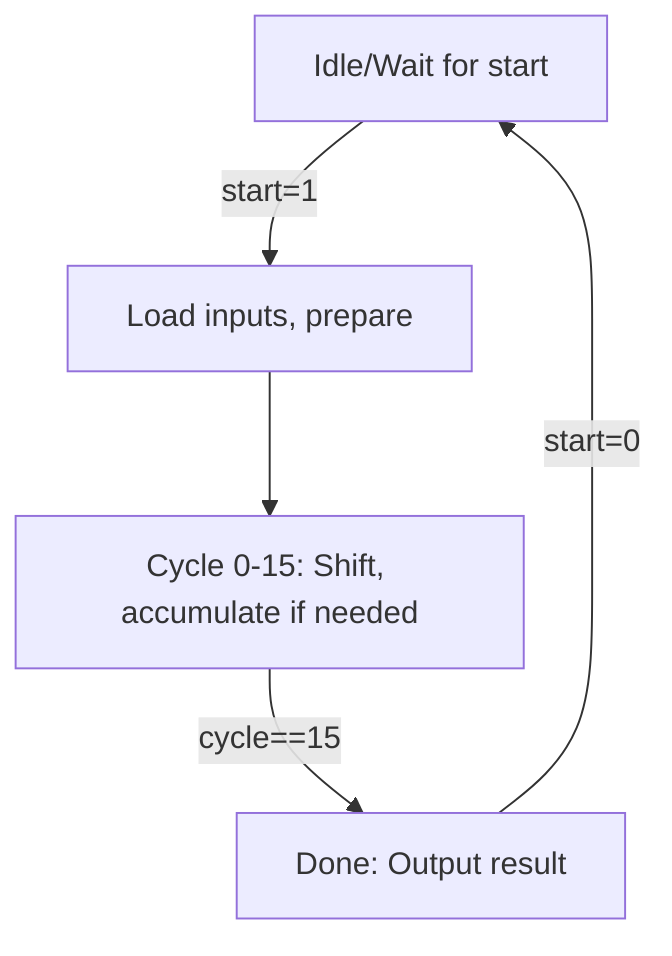
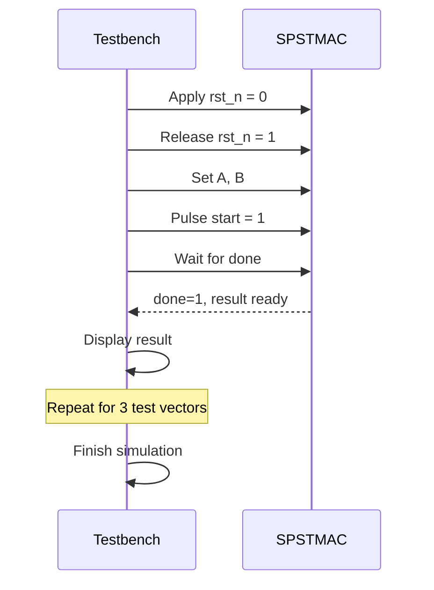

# SPST MAC Unit Documentation

This documentation describes the behavior, purpose, and usage of the Verilog SPST-based Multiply-and-Accumulate (MAC) unit, its testbench, and the associated Xilinx Design Constraints (XDC) file. The SPST MAC employs the Spurious Power Suppression Technique to efficiently perform multiplication, saving power by avoiding unnecessary switching. Below, you’ll find a comprehensive explanation of all included files, their core functions, and their interactions.

---

## 🧩 File Overview

| Filename      | Description                                                           |
|---------------|-----------------------------------------------------------------------|
| `SPSTMAC.v`   | Main Verilog module: 16x16 MAC with SPST-based power reduction        |
| `tb_spst.v`   | Testbench: automatic simulation and verification of MAC functionality |
| `mac.xdc`     | Vivado XDC: pin constraints, I/O standards, and timing setup         |

---

## `SPSTMAC.v` — SPST Multiply-and-Accumulate Core

The primary module implements a **low-power 16x16 multiplier** using the Spurious Power Suppression Technique (SPST). It accumulates the product over 16 cycles, only adding shifted partial products when required.

### Main Features

- **Inputs:**
  - `clk`: Input clock
  - `rst_n`: Active-low synchronous reset
  - `start`: One-cycle start pulse
  - `A`, `B`: 16-bit operands

- **Outputs:**
  - `done`: Goes high when result is ready
  - `result`: 32-bit product

- **Operation:**
  - On `start`, loads operands.
  - In each cycle, checks the current bit of `B` (via `multi`).
  - Adds shifted `A` to accumulator (`acc`) only if the bit is 1.
  - After 16 cycles, asserts `done` and provides the product.

### Core State and Data Flow

| Register    | Width | Role                                                     |
|-------------|-------|----------------------------------------------------------|
| `acc`       | 32    | Accumulator; sums partial products                       |
| `multi`     | 16    | Copy of `B` shifted right each cycle                     |
| `cycle`     | 5     | Counts current cycle (0 to 15)                           |
| `running`   | 1     | Indicates MAC is active                                  |
| `result`    | 32    | Final output (latched when done)                         |

### SPST Logic

- **Partial Product Generation:**  
  Only computes and accumulates if the current LSB of `multi` is 1 (skips otherwise).  
  This avoids unnecessary switching—reducing dynamic power.

### Main FSM and Data Path



### Key Code Snippet

```verilog
assign pp = (multi[0] == 1'b1) ? {16'b0, A} : 32'b0;
assign pp_shift = pp << cycle;

always@(posedge clk or negedge rst_n) begin
  if(!rst_n) begin
    // Reset logic
  end else begin
    if(start && !running) begin
      // Load and start
    end else if(running) begin
      // Accumulate if needed, shift, inc cycle
    end else begin
      done <= 1'b0;
    end
  end
end
```

### Operation Summary

- Reset clears all state.
- On rising `start`, loads `A` and `B`, sets up accumulation.
- For 16 cycles, checks if LSB of `multi` is 1:
  - If **yes**: adds shifted `A` to `acc`.
  - Shifts `multi` right, increments cycle.
- When cycle reaches 15, sets `result = acc + pp_shift` and raises `done`.

---

## `tb_spst.v` — MAC Unit Testbench

The testbench (`tb_spst.v`) automates simulation for the MAC, applying input vectors (A, B), pulsing the `start` signal, and checking results.

### Key Functions

- **Generates clock:** 10ns period (100MHz).
- **Applies reset:** Active for first 12ns.
- **Runs 3 test vectors:**  
  - TV1: 12 × 5 = 60  
  - TV2: 18 × 4 = 72  
  - TV3: 123 × 45 = 5535
- **Assertions:** Waits for `done`, displays calculated result.
- **Waveform dumping:** For GTKWave/other simulation tools.

### Testbench Flow



### Testbench Snippet

```verilog
initial begin
  // Reset
  rst_n = 0; #12; rst_n = 1; #10;
  // TV1
  A = 16'd12; B = 16'd5; #10;
  start = 1; #10; start = 0;
  wait(done); #10;
  $display("TV1: A=%0d B=%0d result=%0d", A, B, result);
  // ...repeat for more vectors
end
```

### Outputs

- Displays the product for each test vector.
- Provides VCD waveform output for post-simulation analysis.

---

## `mac.xdc` — Vivado Constraints

This file defines how Vivado should interpret and implement the MAC design in hardware.

### Key Constraints

| Constraint Type | Command Example                                           | Purpose                                |
|-----------------|----------------------------------------------------------|----------------------------------------|
| Drive Strength  | `set_property DRIVE 4 [get_ports {result[*]}]`           | Lower I/O current for power saving     |
| Slew Rate       | `set_property SLEW SLOW [get_ports {done}]`              | Slower edge = lower EM/noise/power     |
| IO Standard     | `set_property IOSTANDARD LVCMOS12 [get_ports {done}]`    | 1.2V logic for lowest I/O power        |
| Clock Setup     | `create_clock -name clk -period 20.000 [get_ports {clk}]`| 50MHz constraint for synthesis/timing  |
| Input Delay     | `set_input_delay 5 -clock clk [get_ports A[*]]`          | Models external input arrival times    |
| Output Delay    | `set_output_delay 5 -clock clk [get_ports result[*]]`    | Models expected output load timing     |

### Best Practices Highlighted

- **Low drive strength and slow slew:** Cuts unnecessary dynamic I/O power.
- **Low-voltage CMOS standard:** Reduces both static and dynamic power.
- **Input/output delays:** Helps achieve accurate timing analysis.
- **Clock constraint:** Critical for proper synthesis and static timing analysis.

---


**Summary:**
- `tb_spst.v` tests `SPSTMAC.v` in simulation.
- `mac.xdc` guides Vivado for synthesis and implementation.

---

## 📝 Example Usage

**Simulate in Icarus Verilog or Vivado:**

```bash
iverilog tb_spst.v SPSTMAC.v -o tb_spst
vvp tb_spst
# or, use Vivado's simulation GUI for waveform viewing
```

**Expected Console Output:**
```
TV1: A=12 B=5 result=60
TV2: A=18 B=4 result=72
TV3: A=123 B=45 result=5535
```

---

## ✅ Takeaways

- **SPST MAC** optimizes power by skipping unnecessary adds when multiplier bits are zero.
- **Testbench** provides full coverage for basic operation.
- **XDC file** ensures design is both power- and timing-optimized for FPGA.
- This design serves as a template for low-power digital arithmetic units in FPGAs or ASICs.

```card
{
    "title": "Low Power by Design",
    "content": "SPST logic, constraints, and careful testbenching combine to minimize power and ensure correctness."
}
```

---

## 🚩 Suggestions

- For ASIC: Further analyze clock gating or operand isolation for even more power savings.
- For FPGA: Use this as a pattern for other arithmetic units, adjusting XDC as needed for your board.

---

## 📚 Further Reading

- [Xilinx UG912: Vivado Design Suite User Guide - Synthesis](https://www.xilinx.com/support/documentation/sw_manuals/xilinx2019_2/ug912-vivado-synthesis.pdf)
- [SPST Technique for Low Power Multipliers](https://ieeexplore.ieee.org/document/XXXXXXX) *(search for appropriate papers)*

---

**End of Documentation**
